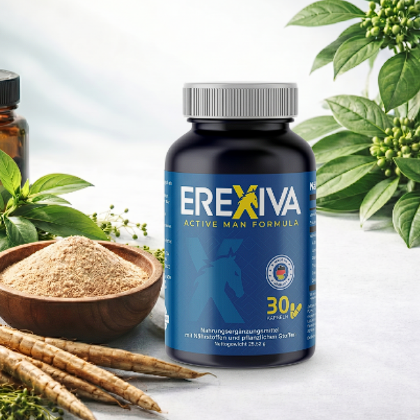
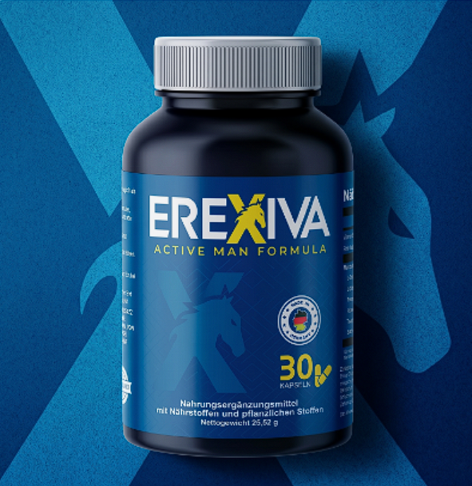

Erexiva Active Man Formula: praktische vitaliteitsgids
======================================================

.. meta::
   :description: Een Nederlandstalige, herschreven consumentengids voor Erexiva Active Man Formula met gebruiksnotities, ingrediëntcontext en officiële links.
   :keywords: Erexiva, Erexiva Active Man Formula, supplement voor mannen, mannelijke vitaliteit, officiële Erexiva website

Erexiva wordt gepresenteerd als een active-man formule voor volwassen mannen die een constantere welzijnsroutine, meer trainingsvertrouwen en ondersteuning voor dagelijkse vitaliteit zoeken. Deze Read the Docs-site is een originele, opnieuw opgebouwde Nederlandstalige gids die lezers doorverwijst naar de officiële Erexiva-pagina voor productdetails, beschikbaarheid en actuele bestelinformatie.

Voor de meest directe productinformatie bezoek je de `officiële Erexiva-website <https://www.erexiva.cc/>`_. Je kunt ook de `officiële Erexiva-productpagina <https://www.erexiva.cc/>`_ bewaren voordat je supplementopties vergelijkt.

Waarom mensen Erexiva onderzoeken
---------------------------------

Veel mannen zoeken naar een supplement wanneer drukke werkdagen, wisselende slaap, minder motivatie of leeftijdsgebonden veranderingen het moeilijker maken om energiek te blijven. Erexiva wordt gepositioneerd rond natuurlijke ondersteuning voor actieve mannen, niet als ingewikkeld klinisch programma. Wie de nieuwste aanbieding, het aantal flesjes of etiketgegevens wil controleren, moet die informatie altijd bevestigen op de `officiële Erexiva-site <https://www.erexiva.cc/>`_.

Deze documentatiegids kiest voor duidelijke informatie zonder overdreven beloftes. Veelvoorkomende redenen om Erexiva te onderzoeken zijn:

* ondersteuning van een actievere dagelijkse routine;
* aanvulling op krachttraining, beweging en herstelgewoonten;
* meer leren over botanische ingrediënten die traditioneel met mannenwelzijn worden geassocieerd;
* productonderzoek overzichtelijk houden voordat je `Erexiva.cc <https://www.erexiva.cc/>`_ bezoekt.

Overzicht van de formule
------------------------

De openbare productinformatie beschrijft Erexiva als een supplement voor mannelijke vitaliteit met plantaardige ingrediënten en mineralen. Ingrediënten die in productmateriaal worden genoemd zijn maca-wortel, tongkat ali, fenegriekzaadextract, zaagpalm, horny goat weed, brandnetelwortel, zink en magnesium. Ingrediëntenlijsten kunnen veranderen, dus gebruik deze gids als algemeen overzicht en raadpleeg de `officiële Erexiva-website <https://www.erexiva.cc/>`_ voor het actuele etiket.

Welzijnsthema's die door het merk worden besproken
--------------------------------------------------

De marketing van Erexiva richt zich op mannelijke energie, zelfvertrouwen, een prestatiegerichte mindset en fysieke activiteit. Een verantwoord supplementgebruik hoort ook hydratatie, slaap, beweging, evenwichtige maaltijden en professioneel medisch advies te omvatten wanneer dat nodig is.

Vaak besproken thema's zijn:

* **Ondersteuning van dagelijkse energie** binnen een gestructureerde welzijnsroutine.
* **Trainingsmotivatie** voor mannen die consistent in beweging willen blijven.
* **Ondersteuning van mannelijke vitaliteit** met botanische ingrediënten die vaak in mannenformules voorkomen.
* **Algemeen welzijn** in combinatie met voeding, rust en stressbeheersing.

Hoe je deze gids gebruikt
-------------------------

Begin met het ingrediëntenoverzicht en vergelijk dit daarna met de actuele flesinformatie op `https://www.erexiva.cc/ <https://www.erexiva.cc/>`_. Als je besluit te kopen, gebruik dan alleen de `officiële Erexiva-pagina <https://www.erexiva.cc/>`_ of een bron die je vertrouwt, en lees alle aanwijzingen op de verpakking.

Belangrijke veiligheidsopmerking
--------------------------------

Erexiva is een voedingssupplement en geen geneesmiddel. Het is niet bedoeld om ziekten te diagnosticeren, behandelen, genezen of voorkomen. Mensen met gezondheidsklachten, mensen die medicatie gebruiken en iedereen die twijfelt over testosteronondersteunende producten moeten vóór gebruik een gekwalificeerde zorgprofessional raadplegen.

.. toctree::
   :maxdepth: 2
   :caption: Inhoud

   ingredients
   usage
   faq
